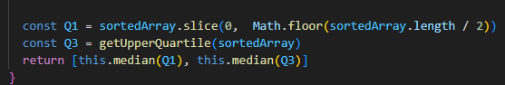
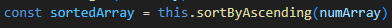
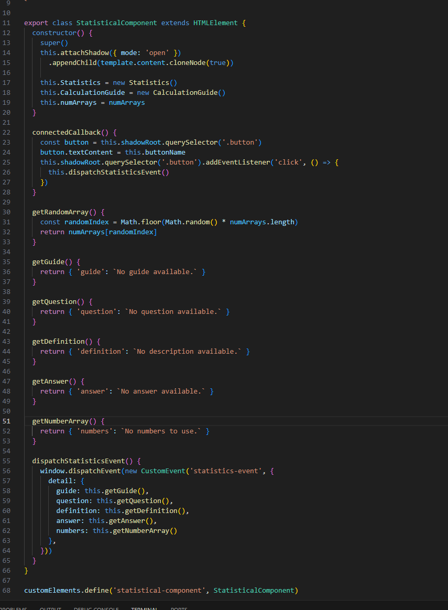

# Reflektion

## Kap 2
Den största delen med kaptiel 2 för mig hart varit att inte använda "mental mapping", att class namn ska vara substantiv och att metoder ska vara verb och även att ha meningsfulla namn. Man kan typ säga att jag har använt mig av mental mapping vid quartiles i modulen där jag har döpt de till Q1 och Q3 istället för quartile1 och quartile3. Detta bör vara tydligt men kan såklart tolkas fel. Jag tycker att den delen som bidragit till att jag verkligen har gjort tydligare namn är att förså att de ska vara meningsfulla. Jag har efter det hellre gjort lite längre namn eller tydligare för att det verkligen ska förstås.
### mental mapping

### meningsfulla namn

## Kap 3
För kapitel 3 så har jag verkligen tagit till mig längden av functioner. Jag tycker personligen att om jag ser en jätte lång function (inte errorhandling) så blir det otydligt direkt. Ett exempel är min kod från 1DV607 där en metod var närmre 20 rader. Även varit väldigt inflytelse rikt att metoder endast ska ha ett mål t.ex antingen göra en sak eller svara på en sak inte både och. Det blev lite svårare i appen då jag typ har en "main" fil som kanske får lite mer arbete än vad den förtjänar. Det sista delen jag vill prata om är DRY. Det bidrar väldigt lätt till att man märker när man kan dela upp saker (så att man inte upprepar).
### långa functioner

### korta functioner

### DRY

## Kap 4
Den bästa kommentaren är den som inte finns. Det här är nog det starkaste jag har fått med mig från hela boken och som jag verkligen har försökt att sträva efter att lyckas med speciellt i appen. Jag har just nu inte en enda kommentar i appen och det var mitt mål. Håll kommentarer tydliga och förklarande till sådant som inte är lätt att förstå (Inobvious Connections). Viktigt att inte kommentera ut kod då det lätt kan bli fel. Man ska använda sig av jsdoc eller liknande när man skriver moduler eller api:er.
### inga kommentarer

### Reflektioner för kap 5-8
[reflektioner del 2](reflektioner/reflektioner2.md)

### Reflektioner för kap 9-11
[reflektioner del 3](reflektioner/reflektioner3.md)

